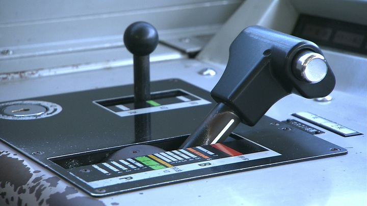
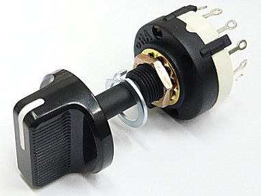
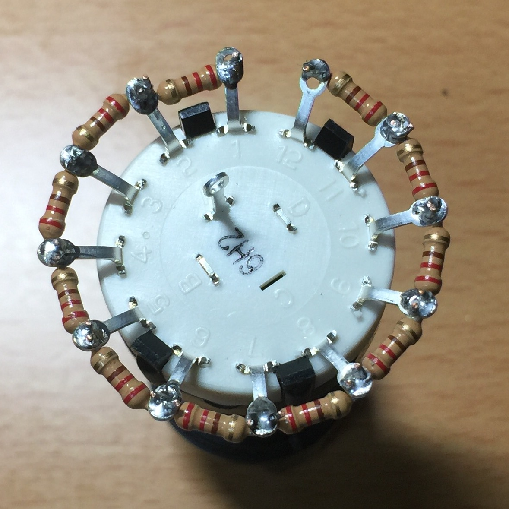
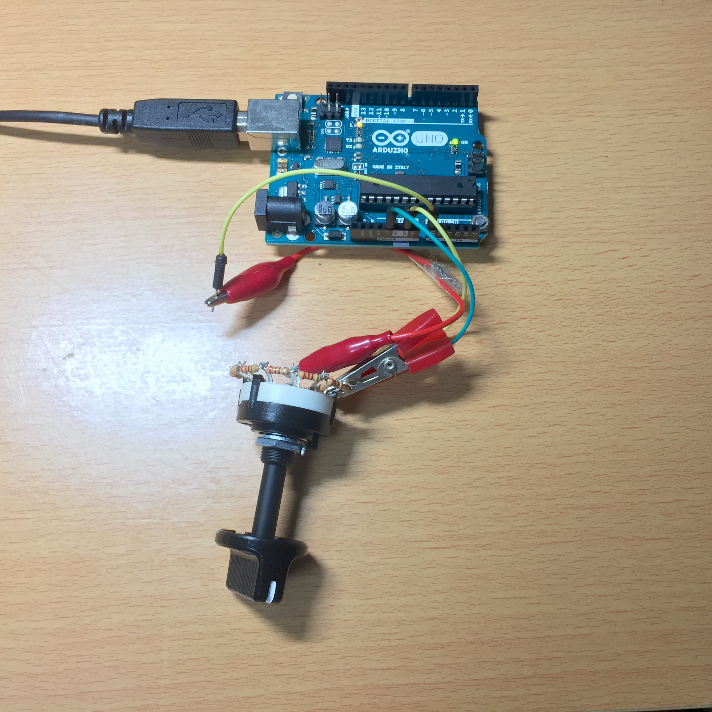
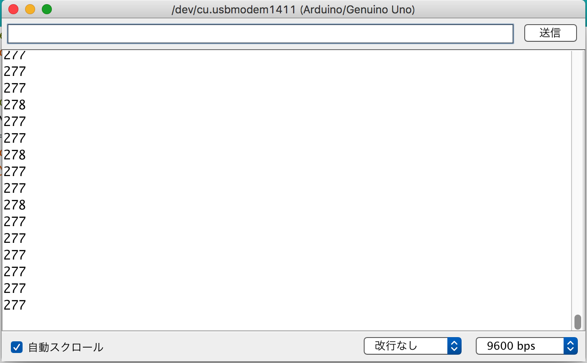
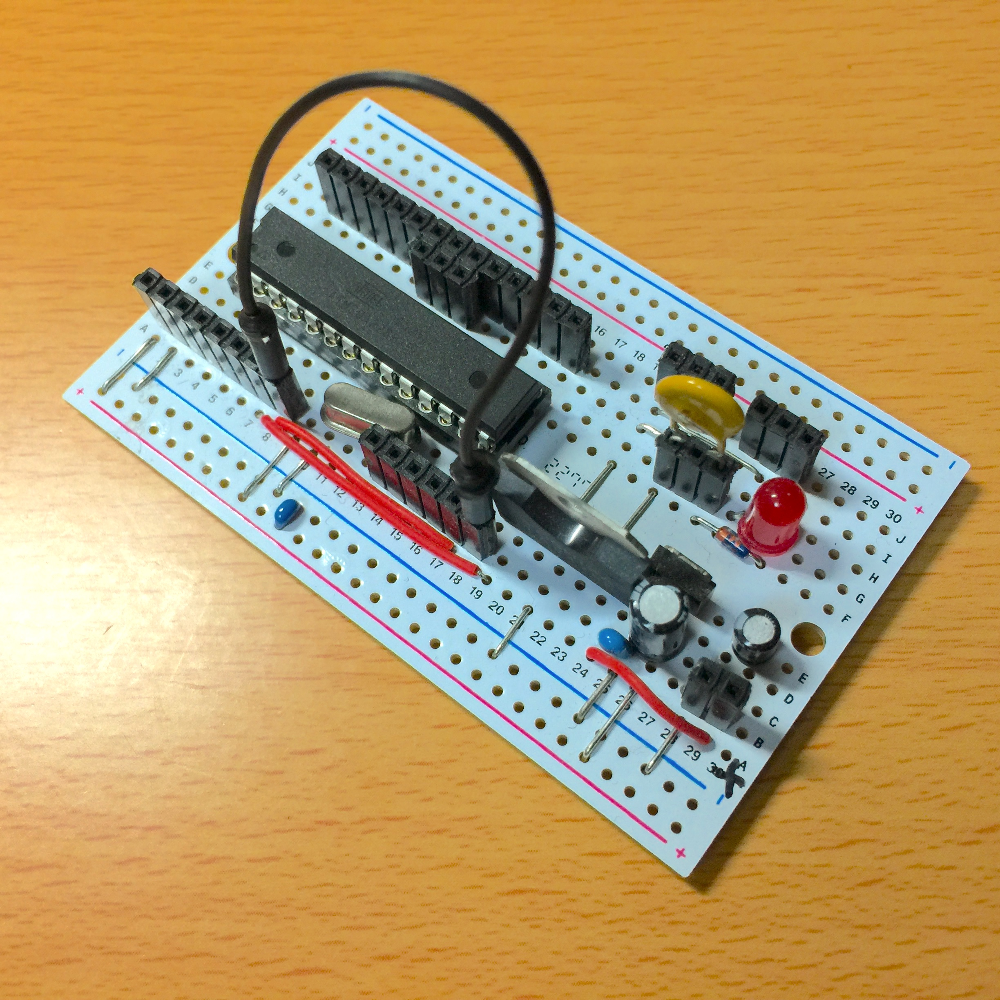
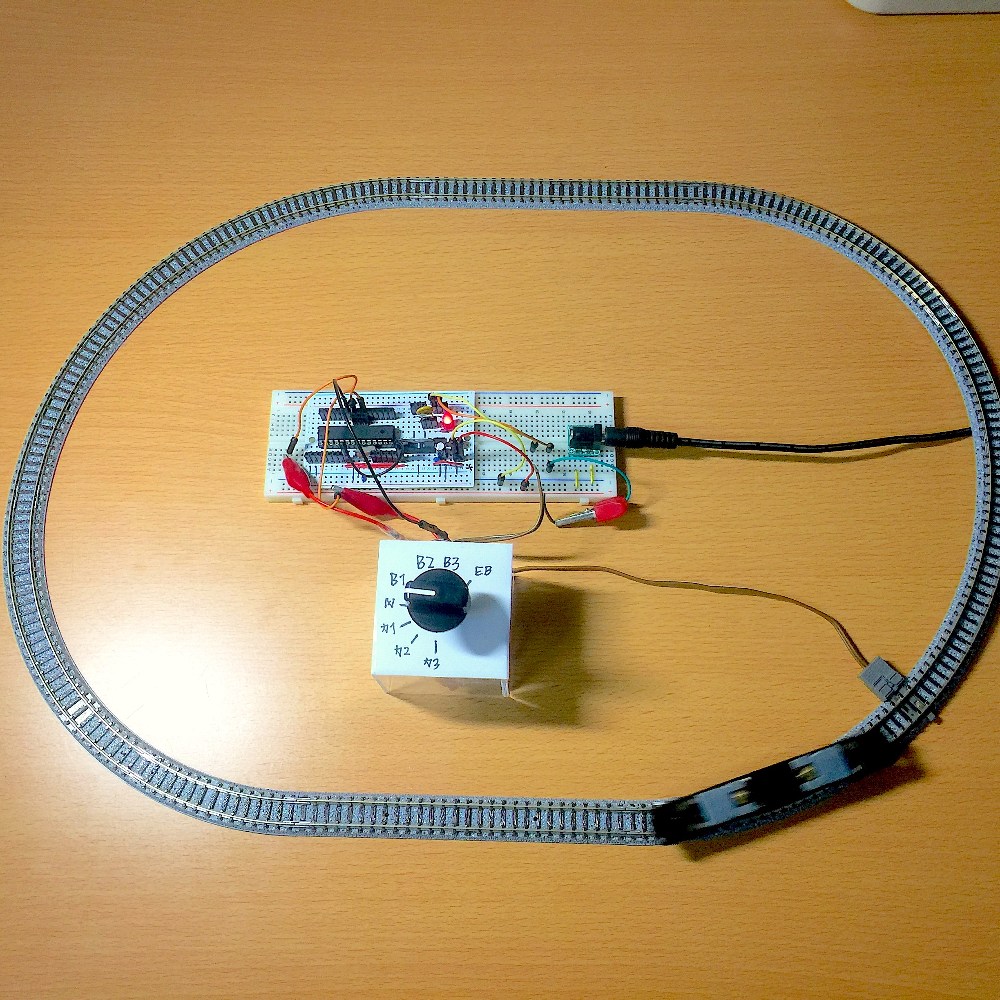

# イタリアで生まれたマイコンボード Arduino で鉄道模型を動かしてみる <!-- ←←←題名 -->
こんにちは。香川大学工学部 学部3年生の太田です。高校時代にArduinoと出会い、Lチカやモータの制御などをして遊んできました。今回、記事を書くということで、改めてArduinoと向き合ってみることにしました。
Arduinoはハードウェアの上で動作するソフトウェアの開発用にC/C++言語ベースのシンプルなArduino言語を採用しており、C言語を使っている人にとって、とても馴染みやすい文法を持っています。更に、開発環境が無料で提供されていることから、ハードウェアプログラミングの学習を始めやすいこともArduinoの特徴です。
そこで、今回はArduinoを用いて鉄道模型を実物同様に加減速制御するコントローラを作っていきましょう。

## Arduinoについて
Arduinoは、Arduino言語と統合開発環境から構成されるシステムです。2005年にイタリアのイベリアで、Massimo BanziとDavid Cuartiellesによって学生向けプロトタイピングプラットフォームとして立ち上げられました。AVRマイコン、入出力ポートを備えた基板、C/C++風のArduino言語、およびそれの統合開発環境から構成されていることが特徴です。2010年以降のIoTの流行に伴い、IoTデバイスとして大きな注目を集めています。

## 環境
Arduinoの開発環境および使用したArduinoは以下のとおりです。特にArduino IDEはスケッチをコンパイルして転送する時に必要なので必ず用意しておきましょう。
- Arduino IDE 1.6.10
- Arduino UNO R3

## マスターコントローラの再現
電車には必ずノッチ(車で言うアクセル)とブレーキが付いています。これらはマスターコントローラ(鉄道車両の出力や速度を遠隔制御するスイッチ装置。以下、マスコンと呼ぶ)と呼ばれています。マスコンハンドルの位置によってブレーキが強くなったり加速したりしますよね？



マスコンを再現するにあたり、今回は位置選択に最も最適な「ロータリースイッチ」という部品を使ってみましょう。以下の写真に写っている部品がロータリースイッチです。



## どのように鉄道模型を動かすか
制御の流れとしては、

- ロータリースイッチの抵抗値を検出
- ADコンバータで数値に変換
- 数値に応じてPWM制御

という処理を繰り返すことになります。PWMとは電圧を制御する方法の一つです。出力のオンとオフのスイッチを行うことで、パルス幅に比例した電圧を得ることができます。今回使用するArduino UNOでは3、5、6、9、10、11番ピンでPWMの出力をサポートしています。これを利用して鉄道模型を動かしてみましょう。

## 抵抗付きロータリースイッチの作成
鉄道模型を制御するマスコンとして用いたロータリースイッチは秋月電子で扱っている1回路12接点のものです。今回は付属部品で8接点に制限しています。これの接点に以下の写真のように花びら状に抵抗をハンダ付けしていきます。今回用いた抵抗は220Ωの1/4Wです。


## 抵抗値の検出
ロータリースイッチで制御するためには、予めADコンバータで各接点における数値を知っておく必要があります。Arduinoに以下のスケッチを書いて読み込ませましょう。

コード1 : ロータリースイッチの抵抗の数値を読む
```c
void setup() {
  Serial.begin(9600);  // シリアル通信の確立
}

void loop() {
  int val;
  val = analogRead(0); // Analog in 0からAD変換で抵抗値を読む
  Serial.println(val); // 抵抗値の出力
  delay(500);          // 0.5秒待つ
}
```
コード1は、AD変換を扱うanalogRead()関数を用いて抵抗値を読み込み、それをSerial.println()関数でシリアルモニタに出力しています。
次にロータリースイッチの1番端子をArduinoのGND端子に、8番端子を5V端子に、A端子をA0端子に接続してArduino IDEのシリアルモニタを開き、ロータリースイッチを回したりして出力を確認してみましょう。


- シリアルモニタの出力


環境や抵抗、その他部品の差異によって値は異なります。当方の環境では以下のようになりました。

|ロータリースイッチの位置|マスコンの位置|値|
|:----:|----|----|----|
|1|非常ブレーキ|1023|
|2|ブレーキ3|878|
|3|ブレーキ2|731|
|4|ブレーキ1|583|
|5|惰性走行|436|
|6|力行1|290|
|7|力行2|144|
|8|力行3|0|


ブレーキはブレーキ3の時に最も早く減速し、力行3の時は最も早く加速するようにしました。
例えば数値が70から200の間なら力行2で加速、600から800ならブレーキ2で減速するといったように処理を割り当てていきます。

## 回路の作成
 今回は独自に鉄道模型を駆動するのに特化した回路を製作しました。
必要部品は以下のとおりです。回路図の詳細は私のGithubで公開しています。※1

|部品|個数|概要|
|----|----|----|
|ユニバーサル基板|1|ブレッドボードタイプ|
|16MHzクリスタル|1|外部発振|
|TB6643KQ|1|モータドライバ|
|TA48M05F|1|レギュレータ|
|セラミックコンデンサ0.1μF|3|デカップリング用|
|電解コンデンサ 10μF|1|デカップリング用|
|電解コンデンサ 47μF|1|デカップリング用|
|ポリスイッチ 0.65A|1|回路保護用|
|整流ダイオード(40V1A)1S4|1|逆電圧防止用|
|定電流ダイオード 10mA|1|パイロットランプ用|
|LED|1|パイロットランプ|
|ICソケット 28P|1|マイコン装着用|
|ACアダプタ 12V1A|1|外径 : 5.5mm 内径 : 2.1mm |
|ピンソケット 50P以上|1|分割可能タイプ|

回路図に従って組み立てていくとこのようになりました。



## スケッチを作る
 さて、それでは実際にスケッチを書いていきましょう。こちらも私のGithubで公開しています。※2

コード2 : ロータリースイッチで鉄道模型を制御(rotary.ino)
```c
void setup() {
  pinMode(3, OUTPUT);
  pinMode(4, OUTPUT);
}
int speed = 0;    // 速度格納
int position(int val);

void loop() {
  int cnt = 0;    // カウント変数
  int pos = 0;    // マスコン位置
  while(1) {
    int val = analogRead(0);
    int s = position(val);
    if ( s != pos ) {
      pos = s;
      cnt = 0;
    } else {
      cnt++;
    }
    if ( cnt == 10 ) {
      break;
    }
    delay(5);
  }
  speed += pos;             // 速度を更新
  speed = constrain(speed, 0, 200); // 値の整合
  analogWrite(3, speed);    // PWMの出力
  digitalWrite(4, LOW);
  delay(300);               // 0.3秒待つ
}

int position(int val) {
  if (val < 70) {          
    return 3;   // 力行3
  } else if (val < 200) {  
    return 2;   // 力行2
  } else if (val < 410) {  
    return 1;   // 力行1
  } else if (val < 500) {  
    return 0;   // 惰性走行
  } else if (val < 630) {  
    return -2;  // ブレーキ1
  } else if (val < 800) {  
    return -4;  // ブレーキ2
  } else if (val < 920) {  
    return -6;  // ブレーキ3
  } else {                 
    return -20; // 非常ブレーキ
  }
}
```

スケッチの解説をしたいと思います。setup()関数は、スケッチがスタートした時に1度だけ呼び出される関数です。ここで3番と4番のピンをpinMode()関数でOUTPUTにセットします。こうすることでLEDやモータと行ったアクチュエータを駆動できます。loop()関数は繰り返し処理される内容を書きます。
 今回用いた回路ではスイッチを使用しているので、可動接点が接触状態になる際に、微細で非常に速い機械的振動を起こすチャタリングという現象が発生します。これによる誤検出を防止するため、while(1)の無限ループを用いて、一定の時間内においてロータリースイッチの位置に変化がない場合に次の処理に移るという風にしました。チャタリングの検査をクリアした値は独自に定義したposition()という関数で加速、減速、惰性走行いずれかの判定、およびそれに応じた値の返却が行われます。position()関数で返却された値を、鉄道模型の速度を管理する変数speedに加算していきます。次にconstrain()関数でspeedの値を指定した範囲に収めます。

`constrain(x, a, b)`

|パラメータ|詳細|
|----|----|
|x|計算対象の値|
|a|範囲の下限|
|b|範囲の上限|

xがa未満のときはaが、bを超過した時はbが、a以上b以下ならxがそのまま返却されます。なぜこの処理が必要なのかは後述します。次にanalogWrite()関数を使用してPWMを出力しています。

`analogWrite(pin, value)`

|パラメータ|詳細|
|----|----|
|pin|出力するピン|
|value|デューティ比(0から255)|

valueが0なら0V、255なら5Vという様に数値に応じた電圧が出力されます。そしてモータドライバを通して0Vから12Vの電圧に増幅して鉄道模型のモータを動かします。valueの値の範囲が0から255となっているのは、デューティ比を8ビットで管理しているからです。この範囲外の値が引数として入ると誤作動を引き起こしてしまう恐れがあります。これを防ぐためにconstrain()関数で、変数speedの取りうる値の範囲を制限しています。そして4番ピンを入力(LOW)にし、抵抗値取得時のチャタリング防止および加減速の再現のために、最後に300ミリ秒待機させます。ここの時間を大きくすれば加減速が遅くなり、短くすれば速くなります。

## Arduinoに転送する
Arduinoに転送してマイコンを基板に差し替えて電源を入れてロータリースイッチを加速位置に回してみましょう。鉄道模型が動きだしましたか?


## おわりに
今回はArduinoを用いて鉄道模型を動かしてみようという内容でした。
ここで紹介したのはほんの一例です。Arduinoはパソコンとの連携も可能なので、パソコン上でダイヤを組み、信号を制御し、ポイントを動かす、などといった実物さながらのようなことができるかもしれません。今後は某電車運転ゲームのコントローラを使用した鉄道模型コントローラの製作に挑戦してみようと考えています。もし完成しましたら、こちらでご報告させていただく所存です。

## 参考資料
Arduino Wiki : http://www.musashinodenpa.com/arduino/ref/
鉄道模型と電子工作 : http://www.geocities.jp/y_taka216/mokei/index.html

<!-- 以下、注釈 -->
※1 : https://github.com/KeKe115/shMAG_2017_12/blob/master/Projects/shMAG2017_12_diagram.png
※2 : https://github.com/KeKe115/shMAG_2017_12/blob/master/Source/rotary.ino
